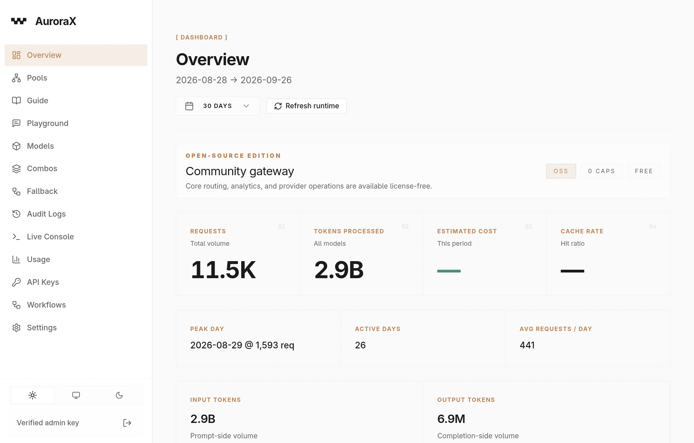

<p align="center">
  
</p>

<h1 align="center">AuroraX</h1>
<p align="center">A self-hosted gateway that puts one OpenAI- and Anthropic-compatible API in front of many LLM providers.</p>

<p align="center">
  <a href="LICENSE"></a>
  <a href="https://github.com/entitybtw/aurora"></a>
  <a href="https://hub.docker.com/r/entbtw/aurora"></a>
  <a href="https://hub.docker.com/r/entbtw/aurora"></a>
</p>

<p align="center">14 provider types &bull; OpenAI &amp; Anthropic compatible &bull; Go &bull; Apache 2.0</p>

<p align="center"><b>Repositories</b></p>

| What | Where |
|------|-------|
| Source code | [github.com/entitybtw/aurora](https://github.com/entitybtw/aurora) |
| Extensions store (live) | [entitybtw.github.io/aurorax-store](https://entitybtw.github.io/aurorax-store) |
| Extensions store (source) | [github.com/entitybtw/aurorax-store](https://github.com/entitybtw/aurorax-store) |
| Docker image | [hub.docker.com/r/entbtw/aurora](https://hub.docker.com/r/entbtw/aurora) |

<a href="docs-assets/assets/dashboard-overview.png">
  
</a>

## Quick deploy

```bash
docker pull entbtw/aurora:latest
docker run -d --name aurora -p 8080:8080 -e AURORA_MASTER_KEY="your-secure-key" entbtw/aurora:latest
```

Dashboard: `http://localhost:8080/admin/dashboard`

For production (persistent config & state, multi-IP host networking) see the
[Deployment guide](documentation/DEPLOYMENT.md).

## Documentation

| Guide | What it covers |
|-------|----------------|
| [Getting Started](documentation/GETTING_STARTED.md) | first run, build, config, basic usage |
| [Deployment](documentation/DEPLOYMENT.md) | Docker / Docker Compose, persistent state, multi-IP |
| [Multi-account pools](documentation/MULTI_ACCOUNT.md) | load-balanced accounts with distinct, stable client identities |
| [Session Hub](documentation/SESSION_HUB.md) | header transformation & session mapping engine |
| [Sidecar](documentation/SIDECAR.md) | extension-driven TLS fingerprint proxy, multi-IP egress |
| [Environment variables](documentation/ENVIRONMENT.md) | complete env var reference |
| [Extensions](documentation/extensions/README.md) | themes, presets, addons — JSON surface, apply flow, safety |
| [Docker image](documentation/DOCKER_PUSH.md) | published image `entbtw/aurora`, tags, publishing |

## What it does

AuroraX sits between your app and LLM providers. Your app talks the standard
OpenAI or Anthropic API — the gateway routes each request to whichever provider
you've configured. One format handles everything.

```python
# Before: hardcoded provider
client = OpenAI(base_url="https://api.openai.com/v1", api_key="sk-...")

# After: AuroraX
client = OpenAI(base_url="http://localhost:8080/v1", api_key="your-aurorax-key")
```

No SDK changes. No format changes. Just swap the `base_url`.

## Features

**Routing & providers**
- 14 provider types — OpenAI, Anthropic, Gemini, Groq, DeepSeek, OpenRouter, xAI, Z.ai, MiniMax, Azure OpenAI, Oracle, Ollama, vLLM, Jina
- Auto-discovery — set a provider's `_API_KEY`, restart, provider and models appear
- Per-provider model auto-fetch toggle, filter (substring / regex / price), custom User-Agent and base URL
- Provider pools — round-robin or weighted distribution, health-aware failover
- Fallback chains — automatic failover on 5xx/429 plus editable manual rules
- Model aliases & overrides, passthrough routes (`/p/{provider}/*`)
- Resilience — exponential backoff with jitter, per-provider circuit breaker

**API surface**
- OpenAI-compatible: `/v1/chat/completions`, `/v1/embeddings`, `/v1/rerank`, `/v1/models`, `/v1/files`, `/v1/batches`
- Responses API (`/v1/responses`) and Anthropic-compatible `/v1/messages`
- SSE streaming end-to-end, keep-only-aliases and allowlist model modes

**Caching**
- Exact cache (SHA-256, Redis), semantic cache (Qdrant / pgvector / Pinecone / Weaviate)
- Prompt cache — forwards native `cache_control` with modes and thresholds
- Model registry cache — local filesystem + Redis, offline-safe

**Security & guardrails**
- Master key, managed API keys with per-key rate limits and model authorization
- PII redaction, prompt-injection blocking, system prompt protection, regex blocking
- Length limits and LLM-based altering, with input/output direction and ordering

**Observability**
- Audit logging (configurable retention, live SSE stream), usage analytics with cost tracking
- Prometheus metrics, structured logging, pprof endpoints
- Admin dashboard built into the Go binary — full provider CRUD, pools, fallback, guardrails, cache, usage, audit, workflows, console, playground

**Cost control**
- Token saver — policy-driven output compression (concise, caveman, ultra, wenyan)
- Per-model pricing overrides, usage budgets per key

**Performance**
- Streaming-first Go request paths; session mapping resolves in well under a
  microsecond per request
- Benchmarked against a mock OpenAI-compatible upstream at 5,000 RPS (60 s
  runs, median of three, Intel i5-10300H): **4,986 req/s**, **100% success
  rate**, **P50 17.7 ms**, **P99 47.2 ms**

**Session Hub** — header transformation engine with per-provider/pool session
mapping, 7 header modes (`map`, `map_or_generate`, `generate`, `passthrough`,
`static`, `random_from_list`, `remove`), configurable charset, disk persistence
and live editing. Full reference: [documentation/SESSION_HUB.md](documentation/SESSION_HUB.md).

**Sidecar** — bundled Bun proxy for extension-driven TLS fingerprinting with
multi-IP egress (one CONNECT proxy per IP) and extension-supplied headers, tools
and retries. Full reference: [documentation/SIDECAR.md](documentation/SIDECAR.md).

**Extensions & store** — portable JSON bundles that configure the sidecar and
Session Hub in one apply; ship tool schemas, identity headers, auth defaults and
optional provider types. Install from a store or by URL
(`POST /sidecar/extensions/import`), then apply from **Settings → Sidecar**.
Review extensions before installing them.

## Quick start

**1. Run the gateway**

```bash
docker run -d --name aurora -p 8080:8080 \
  -e AURORA_MASTER_KEY="your-secure-key" \
  -e OPENAI_API_KEY="sk-..." \
  -e ANTHROPIC_API_KEY="sk-ant-..." \
  entbtw/aurora:latest
```

Or from source: `go build -o aurora ./apps/aurora && ./aurora`
(`aurora init` scaffolds `config.yaml`, `.env` and `data/`).

**2. Verify**

```bash
curl -s http://localhost:8080/health          # {"status":"ok"}
open http://localhost:8080/admin/dashboard    # add a provider
```

**3. Test a model call**

```bash
curl http://localhost:8080/v1/chat/completions \
  -H "Content-Type: application/json" \
  -H "Authorization: Bearer your-master-key" \
  -d '{"model":"groq/llama-4-scout-17b-16e-instruct","messages":[{"role":"user","content":"Hello!"}]}'
```

Anthropic format with streaming:

```bash
curl http://localhost:8080/v1/messages \
  -H "Content-Type: application/json" \
  -H "Authorization: Bearer your-master-key" \
  -H "anthropic-version: 2023-06-01" \
  -d '{"model":"anthropic/claude-sonnet-5-20260630","max_tokens":1024,"stream":true,"messages":[{"role":"user","content":"Hello!"}]}'
```

## Providers

Providers are auto-discovered from environment variables. Set a `_API_KEY` and
restart — the provider and its default models appear.

| Provider | Env var | Default base URL | API key |
|----------|---------|------------------|---------|
| OpenAI | `OPENAI_API_KEY` | `https://api.openai.com/v1` | required |
| Anthropic | `ANTHROPIC_API_KEY` | `https://api.anthropic.com/v1` | required |
| Google Gemini | `GEMINI_API_KEY` | `https://generativelanguage.googleapis.com/v1beta/openai` | required |
| Groq | `GROQ_API_KEY` | `https://api.groq.com/openai/v1` | required |
| DeepSeek | `DEEPSEEK_API_KEY` | `https://api.deepseek.com` | required |
| OpenRouter | `OPENROUTER_API_KEY` | `https://openrouter.ai/api/v1` | required |
| xAI (Grok) | `XAI_API_KEY` | `https://api.x.ai/v1` | required |
| Z.ai | `ZAI_API_KEY` | `https://api.z.ai/api/paas/v4` | required |
| MiniMax | `MINIMAX_API_KEY` | `https://api.minimax.io/v1` | required |
| Azure OpenAI | `AZURE_API_KEY` | — (requires base URL + `AZURE_API_VERSION`) | required |
| Oracle | `ORACLE_API_KEY` | — (requires base URL) | required |
| Ollama | `OLLAMA_API_KEY` | `http://localhost:11434/v1` | optional |
| vLLM | `VLLM_API_KEY` | `http://localhost:8000/v1` | optional |
| Jina (reranker) | `JINA_API_KEY` | — (requires base URL) | required |

Handy knobs:

```env
OPENAI_MODELS=gpt-5.6-sol,gpt-5.6-luna        # override auto-discovered models
OPENAI_BASE_URL=https://proxy.example.com/v1  # custom endpoint
OPENAI_EAST_API_KEY=sk-...                    # → provider openai-east
```

YAML providers add `user_agent`, `auto_fetch_models`, `autofetch_filter`
(substring / regex / price conditions), `bind_ip` and `pool_only` — see
[Deployment](documentation/DEPLOYMENT.md) and
[Multi-account pools](documentation/MULTI_ACCOUNT.md).

Secrets go in your `.env` file (gitignored) or your secrets manager — never
commit them.

## Configuration

Priority (later wins):

```
code defaults → config.yaml → .env / environment variables
```

`aurora init` generates `config.yaml` with every section documented inline:

| Section | What it controls |
|---------|-----------------|
| `server` | Port, base path, master key, passthrough, Anthropic ingress |
| `admin` | Dashboard API and UI |
| `models` | Discovery, overrides, allowlisting |
| `storage` | SQLite (default), PostgreSQL, or MongoDB |
| `logging` | Audit logging of requests/responses |
| `usage` | Token tracking, pricing, retention |
| `metrics` | Prometheus endpoint |
| `guardrails` | Content safety filters |
| `cache` | Model cache, response cache (exact + semantic) |
| `combos` | Multi-model combo definitions |
| `token_saver` | Output compression |
| `fallback` | Provider failover rules |
| `resilience` | Retry + circuit breaker |
| `workflows` | Policy-based request routing |

Pre-built profiles in `configs/editions/`:

| Profile | Use case |
|---------|----------|
| `oss.env.example` | Minimal local — SQLite, no Redis |
| `oss.local-power.env.example` | SQLite + Redis exact cache |
| `oss.team.env.example` | Postgres + Redis + Qdrant — full team deployment |

Every environment variable is listed in
[documentation/ENVIRONMENT.md](documentation/ENVIRONMENT.md).

## CLI

Build from source (`go build -o aurora ./apps/aurora`) and run directly:

| Command | Description |
|---------|-------------|
| `aurora` | Start the gateway server (default port 8080) |
| `aurora init` | Scaffold `config.yaml`, `.env`, `data/` |
| `aurora bindproxy` | Run a single-IP HTTP CONNECT proxy (started automatically per egress IP) |
| `aurora models sync` | Download upstream model registry to a local file |
| `aurora models diff` | Show pricing diff between upstream and local snapshot |
| `aurora models show` | Print effective pricing for a model |
| `aurora -version` / `-help` / `-help-json` | Version, help, env schema as JSON |

## Repository structure

```text
aurora/
├── apps/              # Application entrypoints (gateway, bindproxy subcommand)
├── internal/          # Core packages (providers, gateway, storage, guardrails, sessionhub, admin)
│   └── providers/sidecarclient/sidecar/  # Bun sidecar
├── dashboard-ui/      # React admin dashboard (Vite)
├── configs/           # Configuration profiles and examples
├── documentation/     # Guides (Getting Started, Deployment, Session Hub, Sidecar, …)
├── docs-assets/       # Images, models.json, assets
├── build/             # docker-entrypoint.sh (starts bind proxies + sidecar)
├── Dockerfile         # Multi-stage: runtime / runtime-sidecar targets
├── Dockerfile.runtime # Local-artifact build (build/aurora + dashboard dist)
└── Dockerfile.builder # Combined Go+Bun builder image
```

## License

Apache 2.0 — see [LICENSE](LICENSE).

Community fork of [Aurora](https://github.com/aurorallm/aurora).
Session Hub and multi-account integration built by
[entitybtw](https://github.com/entitybtw/aurora).
